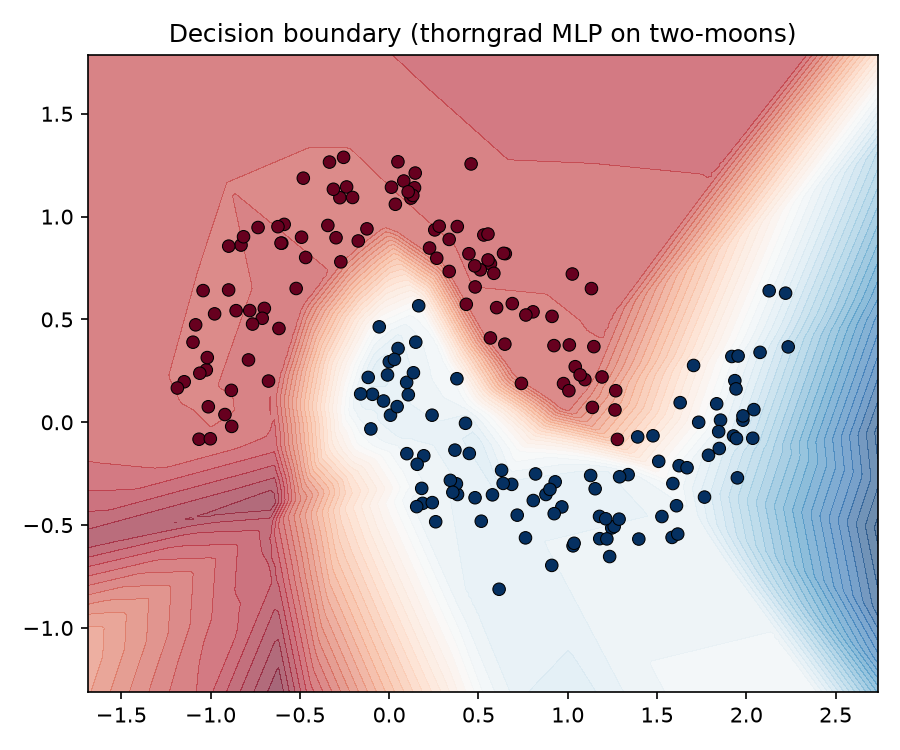
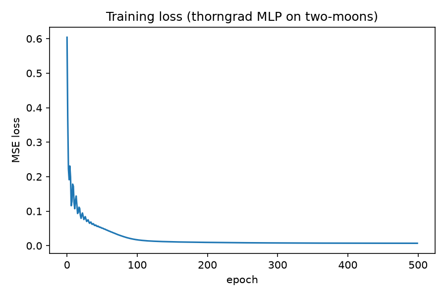

# ThornGrad

A NumPy-backed automatic differentiation engine with broadcasting-aware gradients, built from first principles.

# Why I Built This?
A few months back I followed Andrej Karpathy's Micrograd tutorial and built out an autograd engine from scratch. I found myself coming back to that project as a great learning experience, and decided that I wanted to expand and go further than Karpathy's tutorial -- including NumPy-backed tensors instead of scalars, broadcasting support, more activation functions, optimizer abstractions, etc. What you see here is a passion project designed to further my skills and help learn the inner workings of autograd engines.

# Demo / Results

The demo trains a model on a hand-generated two-moons dataset built with NumPy. The model follows a linear (2, 16), ReLU, linear (16, 16), ReLU, linear (16, 1) sequence and achieves a final loss of 0.0070. The early loss oscillation is expected with a momentum of 0.9.




# Quickstart

## Install
```bash
git clone "https://github.com/Tyler-Simas/Thorngrad"
cd thorngrad
pip install -r requirements.txt
```

## Run the Example
```
python -m examples.train_mlp_classifier
```

## Run Tests
```
pytest -v
```

# API Example
```
from thorngrad_pkg.tensor import Tensor
from thorngrad_pkg.nn import Linear, ReLU, Sequential
from thorngrad_pkg.optim import SGD

model = Sequential(Linear(2, 16), ReLU(), Linear(16, 1))
optimizer = SGD(model.parameters(), lr=0.1, momentum=0.9)

pred = model(x)
loss = ((pred - y) ** 2).mean()
loss.backward()
optimizer.step()
```

# Design Decisions

## Tensor vs. Scalar (NumPy-Backed)
Real ML workloads operate on matrices, not individual scalars. This requires solving broadcasting-aware gradient accumulation, which scalar autograd does not encounter.

## Broadcasting-Aware Gradients
If $y = a + b$ where $a \in \mathbb{R}^{m \times n}$ and $b \in \mathbb{R}^{n}$ is broadcast across $m$ rows during the forward pass, the gradient with respect to $b$ must sum the incoming gradient back down across the broadcast dimension:

$$
\frac{\partial L}{\partial b} = \sum_{i=1}^{m} \frac{\partial L}{\partial y_i}
$$

The incoming gradient must be summed back down along every dimension that was artificially stretched during the forward pass, or the shapes will not match.

## Matmul Gradients
For $Y = AB$, where $A \in \mathbb{R}^{m \times k}$ and $B \in \mathbb{R}^{k \times n}$, the gradients with respect to each input are:

$$
\frac{\partial L}{\partial A} = \frac{\partial L}{\partial Y} B^{\top}, \qquad \frac{\partial L}{\partial B} = A^{\top} \frac{\partial L}{\partial Y}
$$

## Softmax Backward (Jacobian)

The softmax Jacobian is dense — every output depends on every input:

$$
\frac{\partial s_i}{\partial x_j} = s_i(\delta_{ij} - s_j)
$$

where $\delta_{ij}$ is the Kronecker delta. Expanding this against an upstream gradient $g$ via the chain rule and simplifying collapses the full Jacobian–vector product into a closed form that never requires materializing the $n \times n$ Jacobian matrix:

$$
\frac{\partial L}{\partial x_j} = s_j\left(g_j - \sum_{i} g_i s_i\right)
$$

In code, this is computed as a dot product (`sum(g * s)`) followed by a broadcast-subtract and elementwise multiply — an $O(n)$ operation per row instead of an $O(n^2)$ matrix construction.

## Mean Gradient
For $y = \text{mean}(a)$ reducing $n$ elements to one, each input element receives an equal $1/n$ share of the upstream gradient:

$$
\frac{\partial L}{\partial a_i} = \frac{1}{n} \frac{\partial L}{\partial y}
$$

## Weight Initialization
Weights are initialized as:

$$
W \sim \mathcal{N}(0, 1) \times \sqrt{\dfrac{1}{n_{\text{in}}}}
$$

scaling down the variance of each weight in proportion to the number of inputs being summed, so output magnitude stays roughly stable regardless of layer width — preventing vanishing/exploding activations from the very first forward pass.

## Module Separation
Rather than a single file (as in Karpathy's scalar-based tutorial), the engine is split into `tensor.py` (core data structure + graph mechanics), `ops.py` (arithmetic), `functional.py` (activations), `nn.py` (layers/models), and `optim.py` (training). This keeps each file testable in isolation and mirrors how production frameworks separate concerns.

## Project Structure
```
.
├── examples/
│   ├── decision_boundary.png
│   ├── loss_curve.png
│   └── train_mlp_classifier.py
├── tests/
│   ├── test_functional.py
│   ├── test_nn.py
│   ├── test_optim.py
│   └── test_tensor.py
├── thorngrad_pkg/
│   ├── __init__.py
│   ├── functional.py
│   ├── nn.py
│   ├── ops.py
│   ├── optim.py
│   └── tensor.py
├── .gitignore
├── conftest.py
├── README.md
└── requirements.txt
```

# Testing
Two strategies are used: PyTorch cross-checks for exact correctness, and end-to-end convergence tests for optim.py. There are a total of 112 tests divided amongst the four files.

# What's Implemented / Possible Future Work
## Implemented Now
- Operations:
    - add
    - subtract
    - mul
    - div
    - matmul
    - pow
    - sum
    - mean
    - reshape
- Activations:
    - ReLU
    - sigmoid
    - softmax
- Linear/Sequential
- SGD with momentum

## Future Work
- Adam
- More losses (cross-entropy)
- GPU support
- Conv layers

# Acknowledgments
Inspired by Andrej Karpathy's micrograd, without his excellent teaching none of this would have been possible.